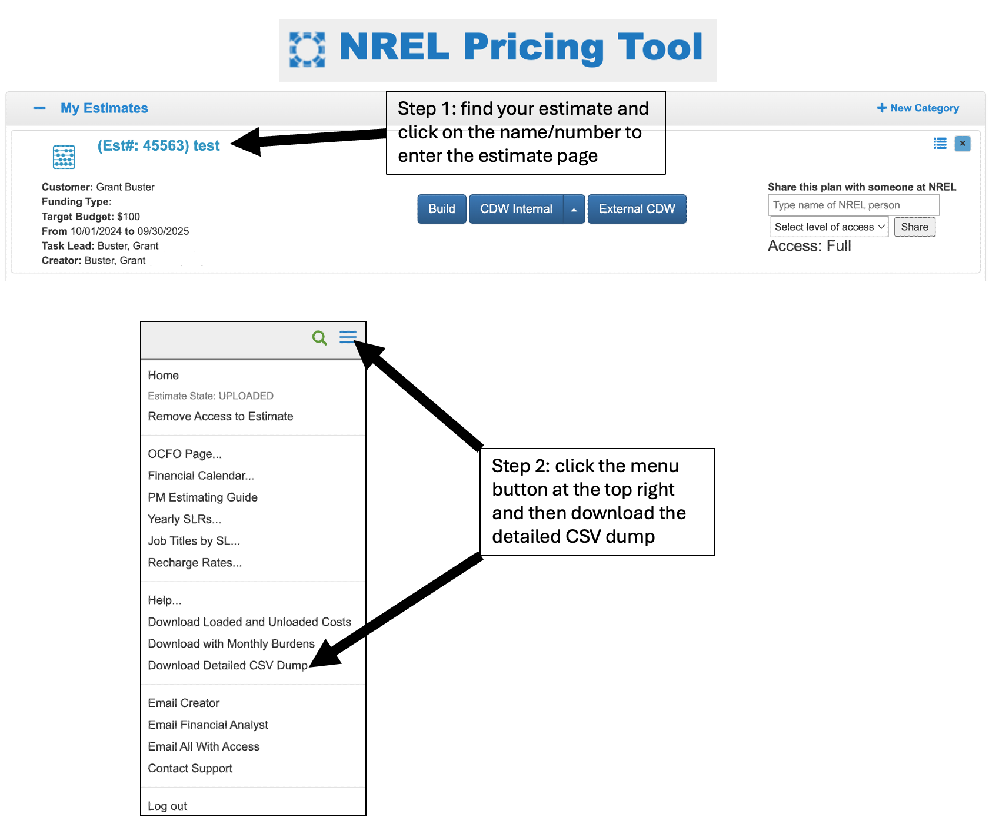
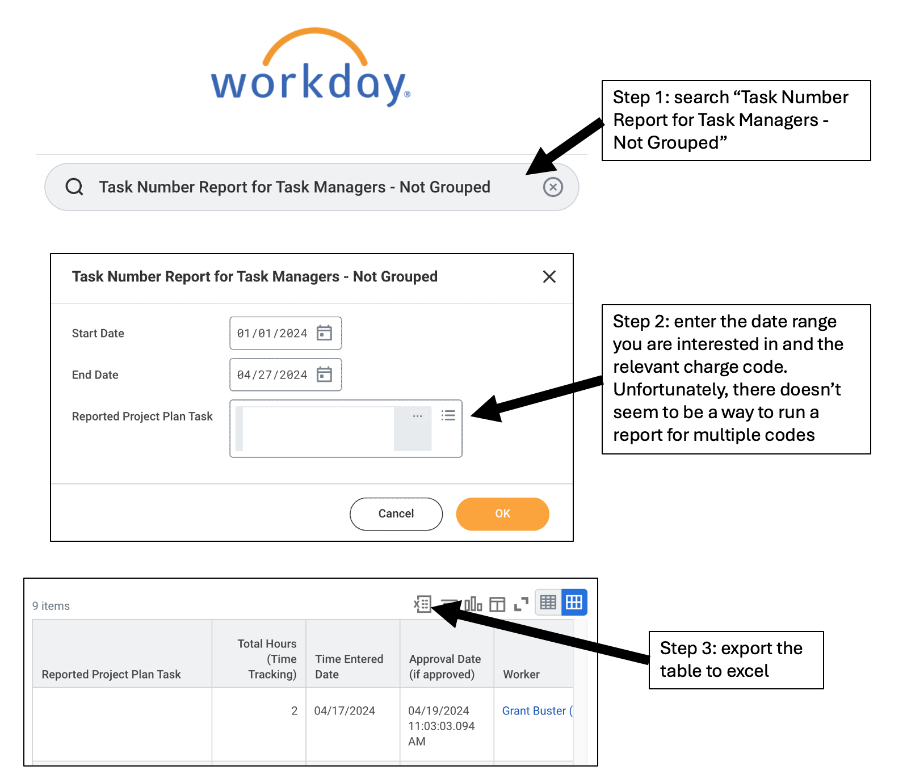

################
Example Analysis
################

Here is an example project planning analysis. It uses csv and xlsx exports from
the NREL pricing tool and workday to compare actual labor charges against
project plans. See the instructions below on how to export from
`Pricing Tool <https://grantbuster.github.io/nrel_p3/example.html#exporting-pricing-tool-estimate>`_
and `Workday <https://grantbuster.github.io/nrel_p3/example.html#exporting-workday-labor-report>`_.

NOTE: all labor rates, overhead fees, employee IDs, charge codes, researcher
levels, are anonymized (this is all business sensitive).

`Here <https://github.com/grantbuster/nrel_p3/blob/main/examples/analysis/run.ipynb>`_
is the jupyter notebook that demonstrates how to run an analysis with
``nrel_p3``. It outputs the following interactive plotly figures but you can
create your own dashboard style plots based on the output data.

.. raw:: html
   :file: ./_static/analysis_trend.html

.. raw:: html
   :file: ./_static/analysis_breakdown.html

Exporting Pricing Tool Estimate
===============================

Exporting Workday Labor Report
==============================

